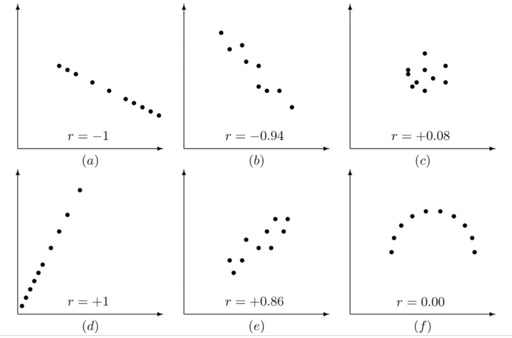

```{r global_options, include = FALSE}
knitr::opts_chunk$set(echo = TRUE, warning = FALSE, message = FALSE, fig.align = "center")
```

## Motivation

Although limited in its applications, in the right circumstances, correlation analysis can be a useful skill to have in your tool-box. 

Simply put, a correlation coefficient measures the strength of association between two variables. As we will see below, correlation coefficients come in several flavors, but they are all measured on the same scale, ranging from -1 to +1, where +1 means that that the variables are perfectly correlated in the same direction, -1 means they are perfectly correlated in opposite directions, and 0 means the two variables are completely independent (Schober, Boer, and Schwarte, 2018):

```{r, echo=FALSE, out.width="50%"}

```

(image [here](https://saylordotorg.github.io/text_introductory-statistics/s14-02-the-linear-correlation-coeffic.html))

Below, we will conduct correlation analyses using data from the [World Happiness Report](https://worldhappiness.report), an annual survey that seeks to quantify well-being and life satisfaction in over 150 countries. The survey uses a unique methodology to gauge happiness in respondents, and reports happiness, on average, per country, along with GDP, healthy life expectancy, and several subjective measures, including generosity, perceptions of government corruption, and self-perceived autonomy and social support. Using several correlation techniques, we will determine which variables are correlated with happiness around the world. 

We'll be using data compiled from the [World Happiness Report](https://worldhappiness.report), publicly available as a [Kaggle dataset](https://www.kaggle.com/mathurinache/world-happiness-report). 

## Background

### World Happiness Report 

It's no question that the pursuit of happiness is one of the biggest drivers of human behavior. But as anyone who has eaten too many cupcakes in this pursuit knows, happiness is a complicated and, often elusive thing. A lot of research is dedicated dissecting and understanding happiness, its links to mental and physical health, economic freedom, family relationships, social networks, etc. And while there has been enormous progress in understanding the internal drivers of happiness (gratitude, sociability, engagement with life), a particularly interesting topic is the influence of key external and environmental factors, one of which is your country of residence.   

You've probably [heard](https://www.wired.co.uk/article/worlds-happiest-country-scandinavia) that Scandinavian countries boast the highest average levels of happiness and life satisfaction. Statistically speaking, it's true. The main quantitative data source on the topic is the [World Happiness Report](https://worldhappiness.report), which, in turn, uses data from the [Gallup World Poll](https://www.gallup.com/analytics/232838/world-poll.aspx) to compile an annual report on the state of world happiness. Year after year, Finland, Norway, Denmark, Sweden, and Iceland rank in the top 10. 

The poll surveys a random sample of respondents and ascertains their happiness by requesting they compare their life to an imaginary dystopia (more details [here](https://worldhappiness.report/faq/)). The measurement system used is known as a [Cantril ladder](https://news.gallup.com/poll/122453/understanding-gallup-uses-cantril-scale.aspx), where the dystopian version equates to a 0 and the best possible life you can imagine for yourself equates to a 10. The poll also measures the respondents' social support, generosity (measured via charitable giving), perceived freedom to choose a life one is satisfied with, and perceived level of government corruption. The World Happiness report takes an average of these results by nation and combines them with every nation's GDP and healthy life expectancy to create a final dataset. These are the variables we will be analyzing here. 

### Correlation

A correlation coefficient is a quantitative measure of the strength of association between two variables. Several coefficients have been defined, but the most common is Pearson's correlation coefficient. As we will see, the validity of a Pearson coefficient is based on several assumptions that are not typically observed in the real world. In these instances, two common alternatives are Spearman's Rank-Order coefficient and Kendall's tau coefficient [^3]. 

Below, we will examine relationships visually, check assumptions, and if all holds, we will determine magnitude of correlation using these coefficients. Each one has certain advantages and disadvantages in terms of application, but all three use the same (-1, 1) scale. 

#### _Pearson's Rho (aka Pearson's Product-Moment Correlation Coefficient)_

Pearson's coefficient is the default and most commonly used, but its application is limited to situations where a specific set of assumptions is met. A detailed list can be found [here](https://statistics.laerd.com/statistical-guides/pearson-correlation-coefficient-statistical-guide.php) but the main ones are: 
- Both variables are measured on a continuous scale 
- Both variables are normally distributed
- Observations are independent
- Variables are linearly related

The last assumption might seem odd - isn't the whole purpose of correlation coefficients to tell us whether there is a linear correlation??? The answer is no. __You must always visually inspect your data first.__ If you see a linear relationship, you can then quantify it using a correlation coefficient. Note, also, that the variables must be __linearly__ correlated. The emphasis on "linearly" correlated means that if your variables have a parabolic, exponential, sinusoidal, etc. relationship, a correlation coefficient is about as useful as a glass hammer. 

The population correlation between two random variables X and Y is defined as: 
\\[\rho_{XY} = \frac {Cov(X,Y)} { \sigma_X  \sigma_Y}\\]

and the sample correlation is defined as: 
\\[ r_{xy} = \frac {\Sigma_{i=1}^n (x_i - \bar x)(y_i - \bar y)} { \sqrt{\Sigma_{i=1}^n (x_i - \bar x)^2 } \sqrt{\Sigma_{i=1}^n(y_i - \bar y)^2}}\\]

#### _Spearman's Rho (aka Spearman's Rank Correlation Coefficient)_

In contrast to Pearson's rho, Spearman's rho [\rho] is a non-parametric statistic, meaning it can be applied to non normally-distributed data (Puth, Neuhäuser, & Ruxton, 2015). 

Spearman's coefficient also does not stipulate that the two variables must be linearly correlated - rather, they must have a __monotonic__ relationship, meaning that when one variable increases, so does the other (not necessarily in a linear fashion.)[^1] This picture is all you need to understand monotonicity: 

<figure>
    
</figure>

Finally, Spearman's coefficient does not require that the variables be continuous, so you can use categorical variables, as long as they are ordinal.

The trade-off for this flexibility is that the Spearman coefficient is slightly less interpretable. Essentially, we are not measuring the direct correlation using our exact data values. Instead, we are correlating the __rank__ of each value within one variable to the _rank_ of each value in another. 

For example, here are the top 6 values of the `healthy_life_expectancy` vector: 
```{r}
c(76.80458, 76.77171, 75.00097, 74.40271, 74.10245, 73.80193)

```

When we compute Spearman's coefficient, these values are instead ranked, so Spearman's test would interpret 76.80 as 1, 76.77 as 2, and so on, and then correlate these ranks to the ranks of the second variable. 

Because of this adjustment, Spearman's coefficient is completely tolerant to outliers. But you have to bear in mind that when you compute and interpret a Spearman coefficient, you're dealing not with direct correlation between two variables but the rank correlation, so ensure you're interpreting accordingly. 

The formula for computing Spearman's coefficient is the same as Pearson's, but rather than dealing with X and Y, we're dealing with the rank of X and Y:

\\[\rho_{rank_X, rank_Y} = \frac {Cov(rank_X,rank_Y)} { \sigma_{rank_X}  \sigma_{rank_Y}} \\]

If there are no ties, Spearman's coefficient is computed using this [formula](https://statistics.laerd.com/statistical-guides/spearmans-rank-order-correlation-statistical-guide.php):

\\[r_{s} = 1 - \frac {6* \Sigma d_i^2} {n(n^2 -1)} \\)
where \\(d = rank_{x_i} - rank_{y_i} \\]


#### Kendall's Tau (aka Kendall's Rank Correlation Coefficient)

Kendall's tau is another rank-based, non-parametric statistic. It follows the same assumptions as Spearman's rank-order correlation coefficient, but it produces more robust standard errors and is therefore [thought]((https://statistics.laerd.com/spss-tutorials/kendalls-tau-b-using-spss-statistics.php) to be more suitable for small sample sizes. 

The calculation for Kendall's Tau is actually pretty simple. You (or your software) will simply rank all the x's and all the y's in order, pair them, and count the number of concordant vs discordant pairs. Concordant pairs are ones where \\(x_i > x_{i+1} \\) and \\(y_i > y_{i+1} \\). Discordant pairs are ones where one of those conditions is not met. 

\\[\tau = \frac {number\,concordant\,pairs - number\,discordant\,pairs} {\binom n 2}\\]

The trade-off for the increased precision we get with Kendall's tau is that the estimated correlation coefficients are generally smaller in magnitude than those computed using Spearman's rho (Fredricks & Nelsen, 2007). 


#### Hypothesis Testing

Presumably, you want to use the correlation coefficient to make some inferences about the population of interest. To do so, you need to conduct a hypothesis test and report either a p-value or a confidence interval. We will look at several functions for doing this in R below, but all have the following null and alternative hypotheses: 
* \\( H_0: \rho = 0 \\) there is no linear (or monotonic, in the case of Spearman and Kendall) association between the two variables in the population 
* \\( H_a: \rho \ne 0 \\) there is a linear/monotonic association between the two variables in the population. 

You can also conduct a one-sided test, where the alternative hypothesis would be one of the following: 
* \\( H_a: \rho > 0 \\)
* \\( H_a: \rho < 0 \\)


## Data Preparation

### Data Source

These data were taken from the [World Happiness Report](https://worldhappiness.report), publicly available as a [Kaggle dataset](https://www.kaggle.com/mathurinache/world-happiness-report). We will be restricting analysis to 2020 data. 

### Libraries

```{r libraries}
library(tidyverse)
library(skimr)
library(PerformanceAnalytics)
library(Hmisc)
library(corrplot)
library(ggcorrplot)

```


#### Data Import

The Kaggle [dataset](https://www.kaggle.com/mathurinache/world-happiness-report) loads in a zip file containing a separate .csv for every year from 2015 to 2020. We will use the 2020 data here. 

```{r import}
happy_df = read.csv(file = "../data/2020.csv") %>% 
  janitor::clean_names() 

head(happy_df)

```

### Data Tidy

Let's take a closer look at the data. We want to make sure that the variable types R gives us are correct, variables are appropriately named, and that everything we expected in the dataframe is indeed there. We'll also do a quick check to make sure the data are in wide format, wherein each observation (in this case, each country) is represented by a row and each variable measured for that observation is given in a column. The `glimpse()` function in `dplyr` is a great simple check for all these things. 

```{r structure}
glimpse(happy_df)

```

Everything looks good: we have 153 observations (countries) across 20 variables. The countries and regions are categorical variables, while the happiness outcome measure (`ladder_score`) and all the potentially associated variables (`social_support`, `perception_of_corruption`, etc) are numerical. 

Next, we will scan for missing values and get a feel for some basic measures of central tendency across our variables of interest. `skimr::skim()` is a great function that packs a lot of information in one line of code: 

```{r missing_values}
skimr::skim(happy_df)

```

Overall, the dataframe looks healthy. We don't have any missing values, and the means look reasonable. Let's take a closer look at the variables and their summary stats and distributions below.   

### Variables Used

The variables of interest (as detailed [here](https://worldhappiness.report/ed/2019/changing-world-happiness/)) are: 
- `country_name`: 153 countries total
- `regional_indicator`: Classification for continental sub-regions, values `r levels(happy_df$regional_indicator)`
- `ladder_score`: This is our outcome variable, the happiness ladder score. As we saw above, the mean `ladder_score` was 5.47 and the values appear normally distributed. 
- `logged_gdp_per_capita`:  Pretty much what it sounds like, the log of per-capita Gross Domestic Product. Economists like log GDP (and logs of other economic measures) since a vertical move on the log scale corresponds to the same percentage change in the measure (better explanation [here](https://econbrowser.com/archives/2014/02/use-of-logarithms-in-economics)) 
- `social_support`: National respondents' proportion of "yes" answers to the question "If you were in trouble, do you have relatives or friends you can count on to help you whenever you need them, or not?" The question is coded binary (0 = no, 1 = yes) and the mean is 0.809 (pleasantly high in my opinion)
- `healthy_life_expectancy`: The WHO's measure of a country's healthy life expectancy at birth. From the `skim()` output above, it averages 64.4 years and is somewhat left-skewed, meaning that most countries have a higher than average healthy life expectancy
- `freedom_to_make_life_choices`: National respondents' proportion of "yes" answers to the question "Are you satisfied or dissatisfied with your freedom to choose what you do with your life?” The question is coded binary (0 = no, 1 = yes) and the mean computed above is 0.783.
- `generosity`: The residual of regressing the national average of responses to the question “Have you donated money to a charity in the past month?” on per-capita GDP. Basically, this means that if we ran a regression of GDP (independent variable) vs the proportion of "yes" answers to this question (dependent variable), `generosity` would equal the gap between the expected value and the actual value. It's really just a means of controlling for income. Per our analysis above, the variable range is (-0.301, 0.561) and centers on -0.0146. 
- `perceptions_of_corruption`: National respondents' proportion of "yes" answers to the question "Is corruption widespread throughout the government or not?" The question is coded binary (0 = no, 1 = yes) and the mean is 0.733.

## Analysis

### Assumptions

Let's first get a handle on how our data behave. Remember that to use Pearson, we need normally distributed variables and a linear relationship, and to use Spearman or Kendall, we need a monotonic relationship. 

To get a visual of all the individual relationships, we could generate scatter plots for each variable of interest vs the outcome of interest. This would be cumbersome. We'll use the `chart.Correlation` function in the `PerformanceAnalytics` package instead. Spoiler alert: this can actually calculate all three correlation coefficients for you, but for now, just pretend you don't see any of the numbers on the chart below. 

```{r}
chart.Correlation(happy_df[, c(3,8:12)], histogram = TRUE)

```

Our outcome, `ladder_score` is on the top left, and the left-most column provides the scatter plots for `ladder_score` against all five of the independent variables. The diagonal shows us a histogram for each variable, which helps us decide whether the variable is normally distributed or not. 

Looking at the diagonals, `ladder_score` is normally distributed and `healthy_life_expectancy` could maybe also pass (we'll examine this more closely below). The other variables are clearly skewed. 

Looking at the scatter plots for `ladder_score` on the left-most column,  `social_support`, `healthy_life_expectancy`, `freedom_to_make_life_choices` all appear linearly related to `ladder_score`. `generosity` is neither linear nor monotonic with respect to `ladder_score`, and `perceptions_of_corruption` is not linear but could pass for monotonic. 

### Assessing Normality - Shapiro Wilk Test

Now let's go back to `healthy_life_expectancy` and conduct a more formal hypothesis test. Since we couldn't get a good feel for normality from the distribution, a hypothesis test using the Shapiro-Wilk can help us make a decision before proceeding with analysis. Our hypotheses are: 
* Null hypothesis: Data __are not__ significantly different from a normal distribution
* Alternative hypothesis: Data __are__ significantly different from a normal distribution

[Conducting](http://www.sthda.com/english/wiki/normality-test-in-r) the Shapiro-Wilk test in R is super simple: 

```{r}
shapiro.test(happy_df$healthy_life_expectancy)

```

Since p < 0.05, we reject the null hypothesis and conclude that `healthy_life_expectancy` does not follow a normal distribution. As such, Spearman and Kendall coefficients are more appropriate. (see caveat below)[^3] 

### Computing Correlation Coefficients using `cor()`, `cor.test()`, and ``rcorr()`

#### `cor`

There are several options in R for computing correlation coefficients. The first is base R's [`cor`](https://www.rdocumentation.org/packages/stats/versions/3.6.2/topics/cor) function, which allows selection of Pearson, Spearman, or Kendall using a method argument. We will first specify Spearman based on our conclusions above. 

```{r}
spearman = cor(happy_df$ladder_score, happy_df[, c(8:12)], method = "spearman")
spearman

```

Happiness has a strong positive correlation with social support (r = 0.80), a strong positive correlation with life expectancy (r = 0.78), and a moderate positive correlation with freedom to make life choices (r = 0.59). Happiness has no correlation with generosity (r = 0.07), and a weak negative correlation with perceptions of corruption (r = -0.28). 

Now, let's compare to Kendall: 
```{r}
kendall = cor(happy_df$ladder_score, happy_df[, c(8:12)], method = "kendall")
kendall

```

Just for demonstration, let's also compute the Pearson coefficients and compare them to Spearman's rho and Kendall's tau. 
```{r cor}
pearson = cor(happy_df$ladder_score, happy_df[, c(8:12)], method = "pearson")
pearson

```

Putting everything in a quick table: 
```{r}
pearson = as.data.frame(pearson, row.names = "pearson")
spearman = as.data.frame(spearman, row.names = "spearman")
kendall = as.data.frame(kendall, row.names = "kendall")

knitr::kable(bind_rows(pearson, spearman, kendall))

```

Comparing Pearson vs Spearman, the only big difference with respect to happiness is perception of corruption (Pearson -0.42 vs Spearman -0.28). This isn't surprising, given that `perception_of_corruption` appeared to be the most skewed (i.e. the most deviant from normal distribution) in the `chart.Correlation` matrix we looked at above.  

Comparing Spearman to Kendall, the magnitude of our coefficients dropped to the null pretty sizably, which aligns with the general behavior of Kendall's tau vs Spearman's rho (Fredricks & Nelsen, 2007).

#### `cor.test` and `rcorr`

While `cor` is quick and easy, it does not compute any statistical significance measures. For that, we need [`cor.test`](https://www.rdocumentation.org/packages/stats/versions/3.6.2/topics/cor.test) (base) or [`rcorr`](https://www.rdocumentation.org/packages/ggm/versions/2.5/topics/rcorr) (`HMisc` package). 

The disadvantage of `cor.test` is that it only computes one coefficient at a time, meaning you can't create a matrix in one line. `rcorr`, on the other hand, will give you a matrix of correlation coefficients and their associated p-values. The disadvantages are a) it doesn't compute Kendall's tau and b) you won't get confidence intervals. 

When we run `cor.test`, we see that it actually doesn't give a confidence interval for Spearman coefficients either (although it does for Pearson):

```{r cor.test}
cor.test(happy_df$ladder_score, happy_df$social_support, method = "spearman", conf.level = 0.95)

cor.test(happy_df$ladder_score, happy_df$social_support, method = "pearson", conf.level = 0.95)

cor.test(happy_df$ladder_score, happy_df$social_support, method = "kendall", conf.level = 0.95)

```

So basically, in the context of this analysis, `cor.test` is weak sauce. Let's move on to `rcorr`, looking only at Spearman. `rcorr` does not play with Kendall and won't give you confidence intervals for any type of coefficient. But unlike `cor.test`, `rcorr` will give you a matrix of coefficients and a matrix of p-values: 

```{r rcorr}
happy_df_corr = 
  happy_df %>% 
  select(c(3,8:12)) 

happy_df_corr = as.matrix(happy_df_corr)
rcorr(happy_df_corr, type = "spearman")

```

So we've re-computed the Spearman coefficients from `cor` and we've learned that, with respect to happiness, all correlations except `ladder_score` vs `generoisty` are statistically significant at an alpha level of 0.05. 

We've also learned that all of the correlations functions we computed have gaps and inconveniences. Most likely, if you're doing a correlation analysis in R, you'll need to use some combination of these functions. 

Here's a quick summary of the capabilities of `cor` vs `cor.test` vs `rcorr`: 

|           | R-Package      | Multiple vs single | Coefficients | p-values | CI's |
| --------  | -------------  | -----------------  | ------------ | -------- | ---- |
| `cor`     | `stats`(base) | multiple            | P/S/K        | x        | x    |
| `cor.test`| `stats`(base) | single              | P/S/K        | P/S/K    | P    |  
| `rcorr`   | `Hmisc`       | multiple            | P/S          | P/S      | x    |


### Visualizing Correlation

You may have noted that pretty much everything we learned from `cor`, `cor.test`, and `rcorr` could have been inferred from the `chart.Correlation` above. The only thing we need to change is to adjust the method from default to Spearman. 

```{r}
chart.Correlation(happy_df[, c(3,8:12)], histogram = TRUE, method = "spearman")

```

As before, we see the linear and non-linear associations below the diagonal, the univariate distributions along the diagonal, and the actual Spearman coefficients above the diagonal. `chart.Correlation` even does this nice thing of making the font size proportional with the magnitude of the coefficent itself. Finally, it calculates a p-value and displays it as a star above the coefficient:p-values(0, 0.001, 0.01, 0.05, 0.1, 1) <=> symbols(“***”, “**”, “*”, “.”, " “). 

There are other options for visualizing correlation matrices. [`corplot`](http://www.sthda.com/english/wiki/visualize-correlation-matrix-using-correlogram) and [`ggcorrplot`](http://www.sthda.com/english/wiki/ggcorrplot-visualization-of-a-correlation-matrix-using-ggplot2) are both great for generating customizable correlograms. 
You can explore a full gallery of `corplot` visualization options [here](http://www.sthda.com/english/wiki/visualize-correlation-matrix-using-correlogram), but we'll make one nice one here [^2]. Note, of course, that we're not really interested in the entire chart. We just want `ladder_score` vs everything else.

```{r}
cor_mat = cor(happy_df[, c(3,8:12)], method = "spearman")
corrplot(cor_mat)

```

Big blue circles mean high correlation in the positive direction, and again, we see that social support and healthy life expectancy are most closely correlated with happiness. This `corplot` isn't bad, but let's eliminate the mirror image along the diagonal and change the label colors since red labels freak me out: 

```{r}
corrplot(cor_mat, type = "upper", tl.col = "black")

```

Ok, that's kind of better, but honestly it's not really that useful in our context. If we were looking at many variables and wanted a quick way to assess which ones most closely went with which ones, `corplot` is a great visualization tool. For our purposes here, `cor` and `chart.Correlation` are just fine. 


## Conclusions

After checking assumptions, both visually and by conducting a Shapiro-Wilk test, we concluded that the default Pearson coefficient was not theoretically suitable for our analysis. Working primarily with Spearman's and Kendall's rank-order coefficients, we figured out the following: 
- `chart.Correlation` is a great, highly informative function for analyzing correlations in R and allows for analysis using all three coefficients of interest: Pearson, Spearman, and Kendall
- Based on the World Happiness Report, country-level happiness is most closely associated with social support and healthy life expectancy for that country.[^4]
- The three functions for computing correlation coefficients in R have their own strengths and weaknesses. If `chart.Correlation` is not sufficient for the analysis, some combination of `cor`, `cor.test`, and `rcorr` should be used. 

## Further Reading 

- Great [post](https://rpubs.com/melike/corrplot) exploring `corrplot`
- A wonderfully thorough [analysis]((https://ourworldindata.org/happiness-and-life-satisfaction)) of the Gallup World Poll, beyond the World Happiness Report
- Another great analysis of the same dataset [here]((https://rstudio-pubs-static.s3.amazonaws.com/300262_bf921065f92f4abca6c59594e92d547e.html#happiness-data-preview)
- More on why Scandinavian countries rank so highly in the report [here](https://worldhappiness.report/ed/2020/the-nordic-exceptionalism-what-explains-why-the-nordic-countries-are-constantly-among-the-happiest-in-the-world/)
- Great [commentary](https://s3.amazonaws.com/happiness-report/2012/World_Happiness_Report_2012.pdf) on the World Happiness Report and happiness in general 

## References

- Schober, P., Boer, C., &amp; Schwarte, L. A. (2018). Correlation Coefficients. Anesthesia & Analgesia, 126(5), 1763-1768. doi:10.1213/ane.0000000000002864
- Puth, M.-T., Neuhäuser, M., & Ruxton, G. D. (2015). Effective use of Spearman’s and Kendall’s correlation coefficients for association between two measured traits. Animal Behaviour, 102, 77–84. https://doi.org/10.1016/j.anbehav.2015.01.010
- Fredricks, G. A., & Nelsen, R. B. (2007). On the relationship between Spearman’s rho and Kendall’s tau for pairs of continuous random variables. Journal of Statistical Planning and Inference, 137(7), 2143–2150. https://doi.org/10.1016/j.jspi.2006.06.045


[^1]: Sometimes I imagine Spearman as Pearson's alter ego. He dropped some assumptions and shuffled around the letters in his name and suddenly he's a more flexible (yet less "mainstream") version of his daytime self. 
[^2]: As far as I can tell, the only advantage of `ggcorplot` over `corplot` is that `ggcorplot` can give you p-values on the correlogram. Personally, I think the visual output of `chart.Correlation` is a bit nicer. 
[^3]: It should be noted that Puth et al (2015) performed a meta-analysis of research that selected rank-order measures over Pearson, and found that in most cases, the rank-order coefficients do not out-perform Pearson. 
[^4]: This does not tell us anything about happiness on the individual level. These data cannot be used to determine whether an __individual's__ social support is correlated to their happiness. These are ecologic measures and using them for individual-level inference might lead to [ecologic fallacy](https://en.wikipedia.org/wiki/Ecological_fallacy) 
