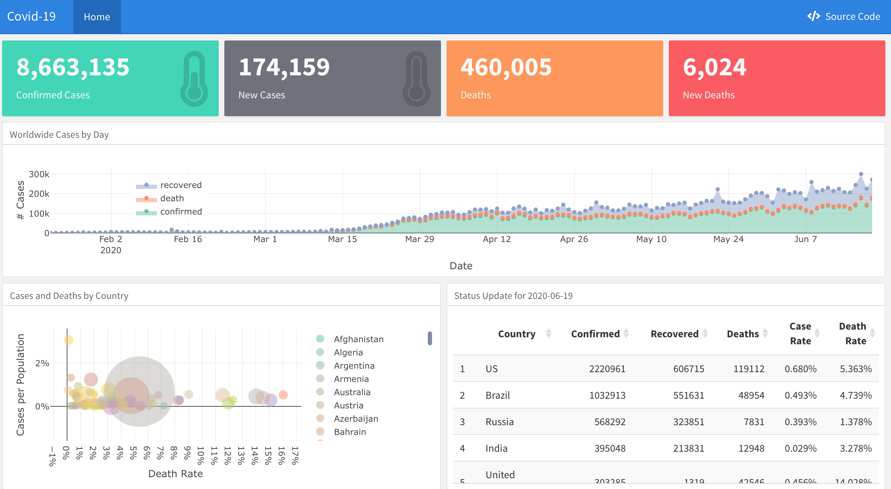

For those following the Covid-19 trajectories, this `flexdashboard` is not a novel concept (pun not intended). [My version](covid_dash.html) is adapted from Rami Krispin's [original](https://ramikrispin.github.io/coronavirus_dashboard/) and uses his `coronavirus` package.

{width="100%"}
