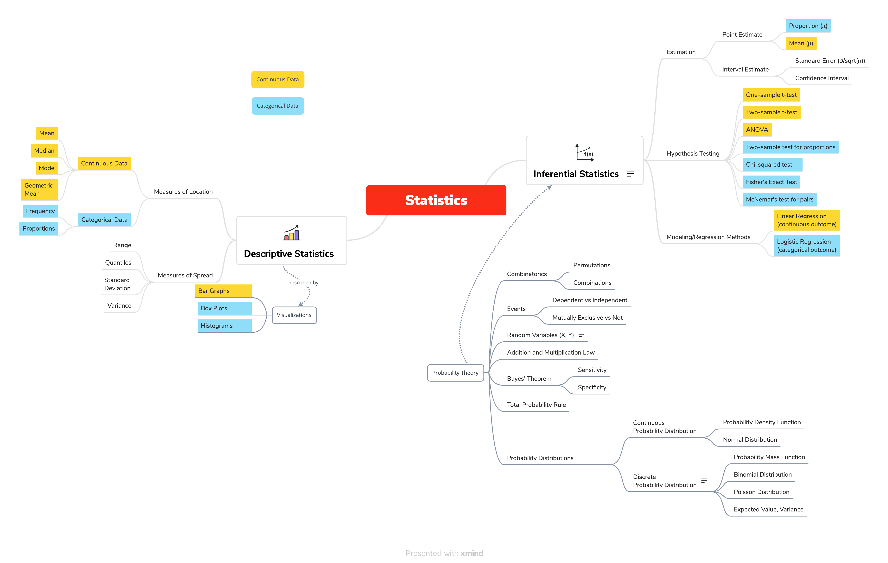

## Motivation

I was recently reflecting on my graduate school experience and trying to answer the "was it worth it" question. With the incredible amount of free educational resources online, why did I instead sacrifice my life's savings to the overlords of higher education? And now that I'm a few years out and in the "real world", do I think that money and time was worth it?

The short answer, for me, is yes. For one thing, it would have been tough to find a job as an Epidemiologist with no prior experience and a bachelor's degree in a totally different field. It gave me some credibility, a starter network, and a sense of what this field actually is and which parts of it I'm interested in.

The other very valuable thing it provided was a "map" in my mind of the concepts we were taught. It's not that I remember every course (in fact, I've probably forgotten more than half of what I learned). But I have an idea of what concepts exist, a rough sense of how they relate to one another, and where to look when I'm solving a problem.

It's kind of like an actual map. You probably don't know what cities exist in Iowa, or even the exact placement of the streets in your neighborhood. But you have some intuition of where your neighborhood is in your city, where your city is in the world, where Iowa is the U.S., and the details you can always find on an actual map.

I think this is an apt analogy for the educational value of my master's degree. Doing this online would have been tough. Piecing together a curriculum, finding quality courses, and having knowledgeable people around to answer questions was pretty valuable.

With that in mind, I endeavored to do a quick review of my statistics coursework - I enjoyed stats classes very much - and I figured the best way to do that would be to jot out a concept map. This ended up taking quite a bit longer than I thought - it's unsettling how much I forgot in 2.5 years. Nevertheless, it provided a very useful memory re-fresh, and gave a bit more resolution to that map floating in my mind.

## Concept Map

Here's the semi-finished product. I will probably refine it over time, so we can call this a first draft.

{width="100%"}

